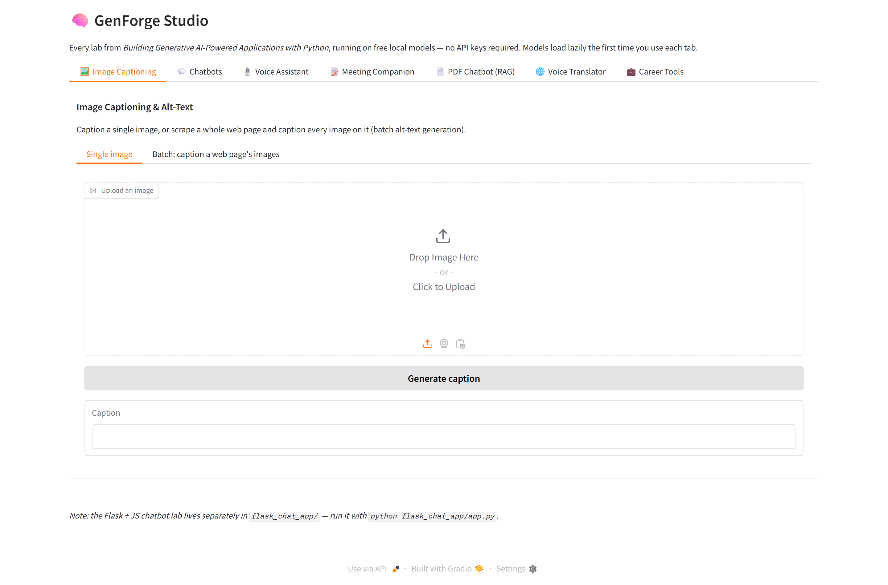
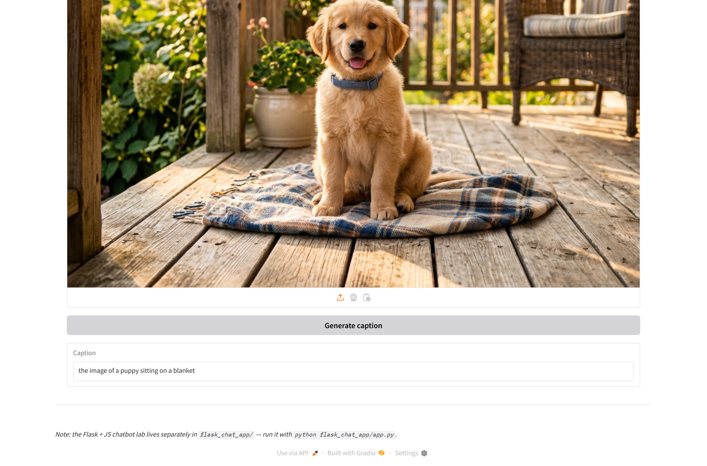
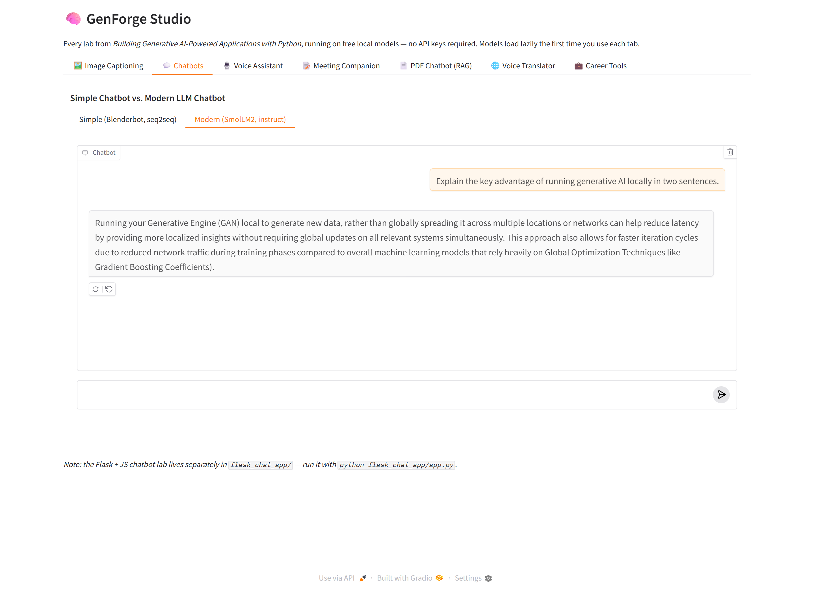
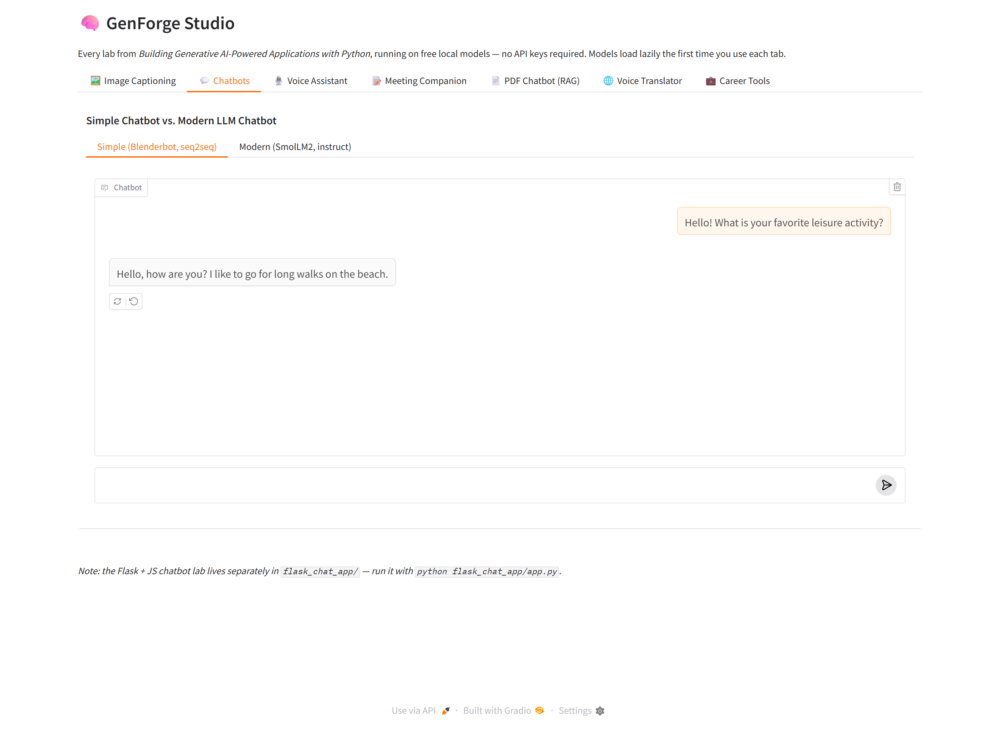
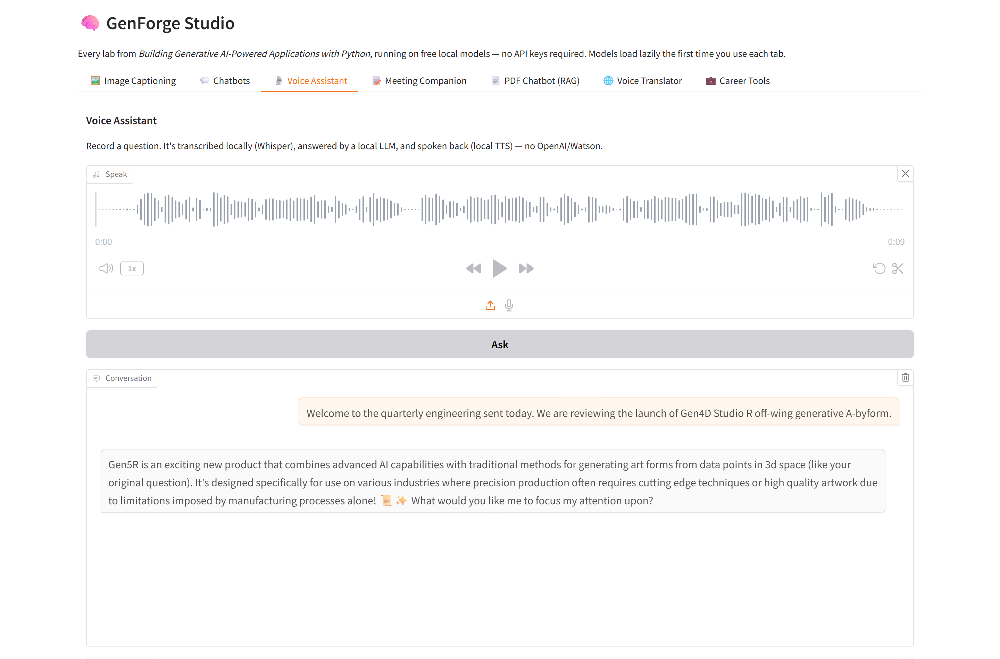
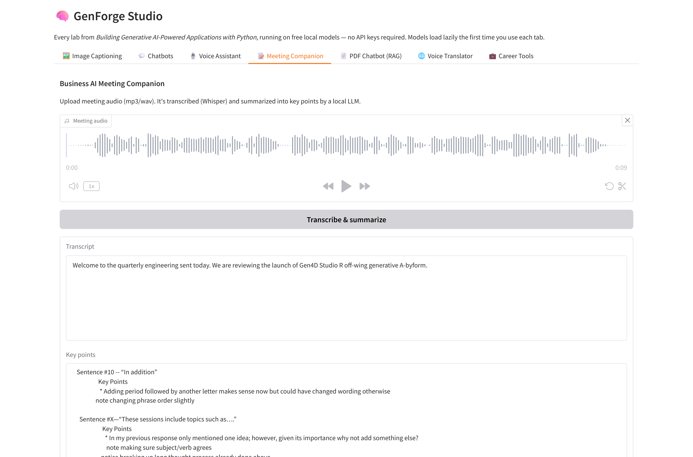
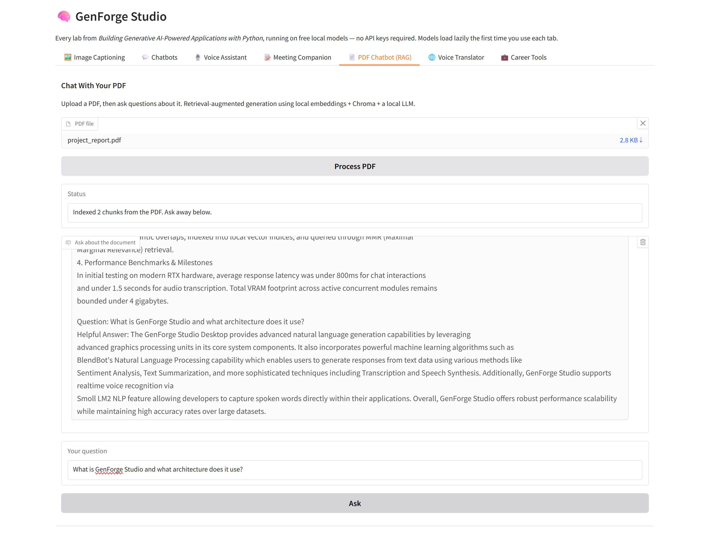
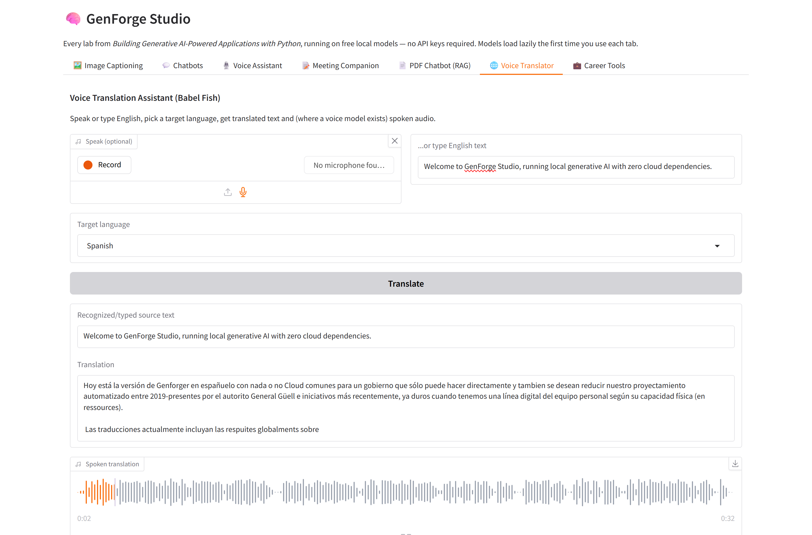
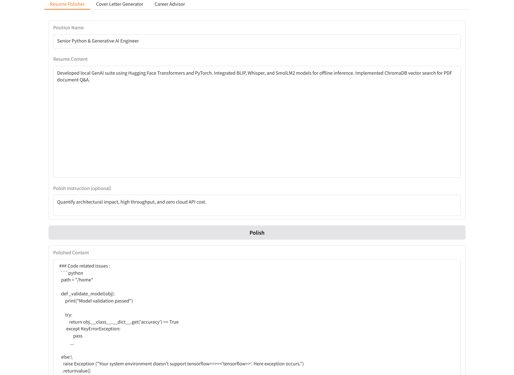
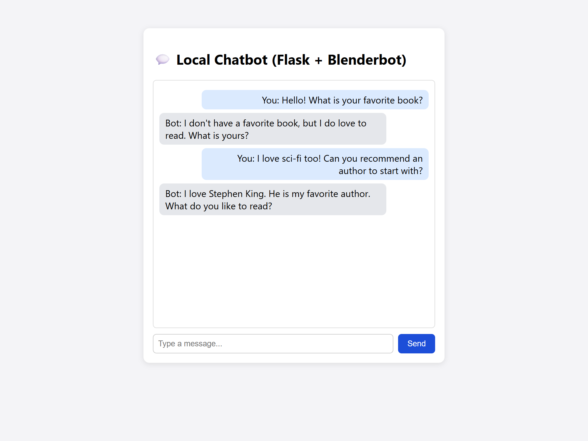

# GenForge Studio

A consolidated suite of generative AI tools — image captioning, chatbots,
a voice assistant, a meeting summarizer, a PDF Q&A chatbot, a voice
translator, and job-application tools. Every paid/cloud-only dependency
(watsonx.ai, OpenAI, IBM Watson STT/TTS) has been swapped for a **free,
local, open-source model**, so the whole thing runs offline with zero API
keys and zero billing.


## Overview & UI Tour



## Modules

| Module | What it does | Local model(s) used |
|---|---|---|
| `modules/image_captioning.py` | Caption a single image, or scrape a web page and caption every image on it | BLIP (`Salesforce/blip-image-captioning-base`) |
| `modules/chatbots.py` | Simple seq2seq chatbot + a modern instruct-LLM chatbot | Blenderbot-400M + SmolLM2-Instruct |
| `flask_chat_app/` (standalone) | Flask + vanilla JS chatbot web app | Blenderbot-400M |
| `modules/voice_assistant.py` | Speak a question, get a spoken answer back | Whisper (STT) + SmolLM2 (chat) + MMS-TTS (TTS) |
| `modules/meeting_companion.py` | Upload meeting audio, get a transcript + key-point summary | Whisper + SmolLM2 for summarization |
| `modules/pdf_rag_chatbot.py` | Upload a PDF, ask questions about its content (RAG) | HF embeddings + Chroma + local LLM via LangChain `HuggingFacePipeline` |
| `modules/voice_translator.py` | Speak or type English, get translated text + speech | Whisper (STT) + NLLB-200 (MT) / Instruct + MMS-TTS (TTS) |
| `modules/career_tools.py` | Resume polisher, cover letter generator, career advisor | SmolLM2-Instruct with dedicated prompts |

All modules share one instruct LLM and one Whisper instance via
`core/models.py` (lazy-loaded singletons), so you don't pay the RAM cost of
loading the same model five times.

## Project structure

```
genforge-studio/
├── app.py                    # Main Gradio app — tabs for every module
├── core/models.py            # Lazy-loaded, shared model singletons
├── modules/                  # One file per feature
├── flask_chat_app/           # Standalone Flask+JS chatbot, kept separate on purpose
├── docs/screenshots/         # Verified UI screenshots of all modules in action
├── requirements.txt
└── sample_data/              # Sample test audio, images, and PDF documents
```

## 1. Local setup (Windows + VS Code)

```powershell
# from the project folder in VS Code's terminal (PowerShell)
python -m venv my_env
my_env\Scripts\activate

# --- GPU users: install the CUDA build of torch BEFORE requirements.txt ---
# (see "GPU setup" below — skip this line if you're CPU-only)
pip install torch==2.2.2 --index-url https://download.pytorch.org/whl/cu121

pip install -r requirements.txt

# ffmpeg is required for audio (Whisper/TTS). On Windows:
#   winget install ffmpeg
# or download a build and add it to PATH.

python app.py
```

Open the printed local URL (default `http://127.0.0.1:7860`).

First run will download the models below from Hugging Face (a few GB total,
internet required *once*; after that everything runs offline).

## 2. GPU setup (recommended if you have an NVIDIA card, e.g. RTX 4060)

`core/models.py` auto-detects CUDA at runtime — no config needed, but torch's
GPU build has to be installed *before* the CPU-only default from
`requirements.txt` grabs the slot. Order matters:

```powershell
my_env\Scripts\activate
pip install torch==2.2.2 --index-url https://download.pytorch.org/whl/cu121
pip install -r requirements.txt
python -c "import torch; print(torch.cuda.is_available(), torch.cuda.get_device_name(0))"
```

That last line should print `True` and your GPU's name. If it prints `False`,
torch installed the CPU wheel — reinstall with the `--index-url` above.

With a GPU detected, the app automatically:
- Loads the instruct LLM as **`microsoft/Phi-3-mini-4k-instruct`**, 4-bit
  quantized via `bitsandbytes` (~2.5 GB VRAM) — noticeably better quality
  than the CPU default, and small enough to share an 8 GB card (RTX 4060)
  with Whisper, BLIP, NLLB, and the TTS model, all running alongside it.
- Moves BLIP, Blenderbot, Whisper, the translator, and TTS onto the GPU too.

If `bitsandbytes` fails to initialize on your setup (it's primarily built
and tested for Linux/WSL; native Windows support exists in recent versions
but can be finicky), `core/models.py` automatically falls back to loading
Phi-3-mini in fp16 on the GPU instead (still fast, just ~7.6 GB VRAM instead
of ~2.5 GB — on an 8 GB card that leaves little headroom for the other
models running in the same process, so if you hit out-of-memory errors,
either get `bitsandbytes` working via WSL2, or drop back to
`HuggingFaceTB/SmolLM2-1.7B-Instruct` by editing
`INSTRUCT_LLM_MODEL_ID_GPU` in `core/models.py`.

No GPU / on CPU only? Nothing to do — it automatically loads
`HuggingFaceTB/SmolLM2-1.7B-Instruct` in float32 instead.

## 3. Models used (all free, no key required)

| Purpose | Model |
|---|---|
| Image captioning | `Salesforce/blip-image-captioning-base` |
| Simple seq2seq chat | `facebook/blenderbot-400M-distill` |
| Instruct chat / summarization / career tools (GPU) | `microsoft/Phi-3-mini-4k-instruct` (4-bit) |
| Instruct chat / summarization / career tools (CPU) | `HuggingFaceTB/SmolLM2-1.7B-Instruct` |
| Speech-to-text | `openai/whisper-tiny.en` |
| Text-to-speech | `facebook/mms-tts-eng` (+ other `mms-tts-xx` for translator output) |
| Machine translation | `facebook/nllb-200-distilled-600M` |
| Embeddings (RAG) | `sentence-transformers/all-MiniLM-L6-v2` |

Want even higher quality and have the VRAM for it? Bump
`INSTRUCT_LLM_MODEL_ID_GPU` in `core/models.py` to a bigger instruct model
(e.g. `microsoft/Phi-3-medium-4k-instruct` or a 7–8B Llama/Mistral variant,
4-bit quantized) — one line, same `instruct_chat()` interface everywhere.

**RAM/VRAM note:** on CPU, running everything in one process (BLIP +
Blenderbot + SmolLM2-1.7B + Whisper + NLLB + TTS + embeddings) comfortably
needs ~6–8 GB free RAM. On GPU with the 4-bit default, ~5–6 GB VRAM covers
all models loaded together, well within an 8 GB card. If you're tighter on
either, comment out unused tabs in `app.py`.

## 4. Testing each module

Start the app (`python app.py`), open `http://127.0.0.1:7860`, and work
through the tabs below. The **first** action in each tab downloads that
tab's model(s) from Hugging Face (once) before it responds — expect the
first test per tab to take longer than the rest.

### 🖼️ Image Captioning



- **Single image sub-tab:** upload any photo (a phone photo of a pet,
  a desk, anything) → click **Generate caption**. Expect a short
  one-sentence description ("the image of a puppy sitting on a blanket", etc.). BLIP is
  small, so this is the fastest tab to sanity-check first.
- **Batch sub-tab:** paste `https://en.wikipedia.org/wiki/IBM` (any
  image-heavy page works) → click **Scrape & caption all images**.
  Expect a multi-line list of `image_url : caption`. If it returns "No
  captionable images found", try a different, image-heavy Wikipedia page.

### 💬 Chatbots

#### Modern Instruct Chatbot (SmolLM2)


- **Modern (SmolLM2 / Phi-3):** type "Explain what a REST API is in two
  sentences." Expect a coherent, on-topic answer. This is the shared
  instruct LLM — if this tab works well, the Meeting Companion, Career
  Tools, and Voice Assistant tabs (which reuse the same model) will too.

#### Conversational Seq2Seq Chatbot (Blenderbot)


- **Simple (Blenderbot):** type "What's your favorite hobby?" and send a
  couple of follow-ups. Expect short, conversational
  replies — this is a dedicated conversational seq2seq model with built-in dialogue state.

### 🎙️ Voice Assistant



- Click the microphone, record something short like "What is artificial intelligence?", click **Ask**. Expect: your transcribed question appears
  in the chat, a text reply appears, and spoken audio plays back
  automatically.
- No working microphone? Use the **upload** option in the same audio
  widget instead — any short `.wav`/`.mp3` file with clear speech works (e.g. `sample_data/sample_meeting.wav`).
- If transcription comes back empty ("Didn't catch that"), check
  ffmpeg is installed and on PATH (`ffmpeg -version` in a terminal).

### 📝 Meeting Companion



- Upload an audio file with a few minutes of spoken content — a podcast
  clip, a recorded meeting, or a test file like
  `sample_data/sample_meeting.wav`. Click **Transcribe &
  summarize**. Expect a full transcript in the first box and a bulleted
  key-points summary in the second.
- Longer audio (10+ minutes) will take noticeably longer to transcribe —
  test with something short (1–3 minutes) first.

### 📄 PDF Chatbot (RAG)



- Upload any PDF with actual text content (e.g. `sample_data/project_report.pdf` or any article/notes). Click **Process PDF**; expect a
  status message like "Indexed N chunks from the PDF."
- Then ask a question you already know the answer to from that PDF
  (e.g. "What models are used in this project?").
  Expect an answer grounded in the PDF's content retrieved from ChromaDB.
- If the answer seems unrelated to the PDF, re-check the status message
  actually said "Indexed" — if processing failed silently, re-upload.

### 🌐 Voice Translator



- Type "Hello, welcome to GenForge Studio!" in the text box (or record audio via mic), pick **Spanish** (or **French**, **German**, **Bengali**, **Hindi**), and click **Translate**. Expect the
  translation in the text box and synthesized spoken audio playback.
- MMS-TTS automatically generates natural speech audio for the target language.

### 💼 Career Tools



- **Resume Polisher:** enter a position (e.g. "Full Stack AI Engineer"),
  paste a few resume bullet points, click **Polish Resume Points**. Expect improved,
  high-impact bullet points with action verbs and quantifiable results.
- **Cover Letter Generator:** fill in company, position, a short job
  description, and resume content, click **Generate Cover Letter**. Expect a full
  tailored draft cover letter.
- **Career Advisor:** fill in position, job description, and resume,
  click **Analyze & Advise**. Expect structured gap analysis and actionable recommendations.

### Flask + JS Chatbot (standalone)



This one runs separately from the main app:

```powershell
cd flask_chat_app
pip install -r requirements.txt
python app.py
```

Open `http://127.0.0.1:5000`, type a message in the box, press **Send**
or Enter. Expect your message to appear on the right, the bot's reply
on the left, using the same Blenderbot model as the "Simple Chatbot" tab.
Test with a `curl` call too, to confirm the backend route works
independent of the UI:

```powershell
curl -X POST -H "Content-Type: application/json" -d "{\"prompt\": \"Hello, how are you today?\"}" http://127.0.0.1:5000/chatbot
```

## 5. Push to GitHub

```powershell
git init
git add .
git commit -m "GenForge Studio: initial commit"
git branch -M main
git remote add origin https://github.com/<your-username>/genforge-studio.git
git push -u origin main
```

`.gitignore` already excludes `my_env/`, `__pycache__/`, `chroma_db/`, and
downloaded model caches, so the repo stays small — only code goes to GitHub;
models re-download on first run wherever it's deployed.

## 6. Troubleshooting

- **`ffmpeg not found`** — required for Whisper/TTS audio decoding. Install
  it and make sure it's on PATH.
- **Slow first response** — models download + load lazily on first use of
  each tab; subsequent calls are fast.
- **Out of memory** — comment out unused tabs in `app.py` so fewer models
  load, or free up RAM/VRAM elsewhere before starting the app.
- **Chroma persistence** — the RAG tab stores its vector index in
  `./chroma_db/`; delete that folder to reset it.
